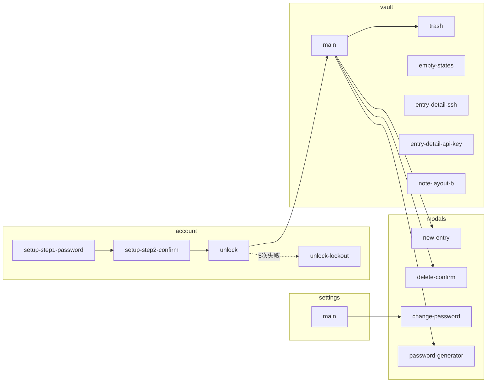

# 原型目录索引与关系图

**版本:** 2026-06-04（目录重组）  
**Canonical 根路径:** `screens/<分类>/<语义名>/`（各含 `code.html` + `screen.png`）

---

## 1. 目录结构

```
docs/软件界面原型/
├── README.md                 # 入口
├── PROTOTYPE-INDEX.md        # 本文件：关系 + 旧名映射
├── UNIFIED-SPEC.md
├── REQUIREMENTS-COVERAGE.md
├── PROTOTYPE-PROMPTS.md
├── design-system/DESIGN.md
├── _shared/                  # 入库脚本、tailwind-extend.json
├── _sources/
│   └── stitch-2026-06-04/    # Stitch 原始导出（勿作实现依据）
├── _archive/                 # 重复 / Future / 非 v1
└── screens/
    ├── account/              # 账户与解锁
    ├── vault/                # 密码库三栏
    ├── modals/               # 浮层模态
    ├── settings/             # 设置
    └── components/           # 可复用片段
```

---

## 2. 用户流程与原型关系



| 关系 | 说明 |
|------|------|
| **main ↔ trash** | 同一三栏壳层；`trash` 为侧栏「回收站」导航态（原 Stitch `keyvault_3` 误标为回收站，canonical 主界面在 `vault/main`） |
| **main + overlay** | 命令面板（Ctrl+K）合并在 `vault/main` 原型内，Vue 为 `CommandPalette.vue` |
| **entry-detail-ssh / entry-detail-api-key** | 同一 `ItemDetail.vue`，条目类型不同 |
| **unlock / unlock-lockout** | 同一 `UnlockView.vue` 的双态 |
| **new-entry / delete-confirm** | 独立模态；删除现为「移至回收站」 |
| **note-layout-b** | 变体 B（320px 列表），v1 **延后**，笔记走 `main` 标准三栏 |

---

## 3. Canonical 屏幕一览

| 新路径 | 界面 | Vue 实现 | 布局变体 |
|--------|------|----------|----------|
| `screens/account/setup-step1-password/` | Setup 第 1 步 | `SetupView.vue` | D |
| `screens/account/setup-step2-confirm/` | Setup 第 2 步 | `SetupView.vue` | D |
| `screens/account/unlock/` | 解锁 | `UnlockView.vue` | E |
| `screens/account/unlock-lockout/` | 解锁锁定 | `UnlockView.vue` | E |
| `screens/vault/main/` | 主界面三栏 + 命令面板 | `VaultView.vue` + Shell | A |
| `screens/vault/trash/` | 回收站 | `VaultView` trash | A |
| `screens/vault/empty-states/` | 空状态三场景 | `VaultEmptyState.vue` | A |
| `screens/vault/entry-detail-ssh/` | SSH/通用详情 | `ItemDetail.vue` | A |
| `screens/vault/entry-detail-api-key/` | API Key 详情 | `ItemDetail.vue` | A |
| `screens/vault/note-layout-b/` | 安全笔记窄列表 | ⏸ 延后 | B |
| `screens/modals/new-entry/` | 新建条目 | `ItemForm.vue` | F |
| `screens/modals/delete-confirm/` | 删除/移至回收站 | `DeleteConfirmModal.vue` | F |
| `screens/modals/change-password/` | 修改主密码 | `ChangePasswordModal.vue` | F |
| `screens/modals/password-generator/` | 密码生成器 | `PasswordGenerator.vue` | F |
| `screens/modals/emergency-wipe/` | 紧急擦除 | —（Future） | F |
| `screens/settings/main/` | 设置 | `SettingsView.vue` | C |
| `screens/components/clipboard-timer/` | 剪贴板倒计时 | `ClipboardTimer.vue` | 组件 |

---

## 4. 旧目录名 → 新路径（迁移对照）

重构文档若仍出现旧名，请改用下表。

| 旧目录（已移除或归档） | 新 Canonical 路径 |
|------------------------|-------------------|
| `screens/account/setup-step1-password/`、`_1/` | `screens/account/setup-step1-password/` |
| `screens/account/setup-step2-confirm/` | `screens/account/setup-step2-confirm/` |
| `screens/account/unlock/` | `screens/account/unlock/` |
| `screens/account/unlock-lockout/` | `screens/account/unlock-lockout/` |
| `screens/vault/main/` | `screens/vault/main/` |
| `screens/vault/trash/` | `screens/vault/trash/` |
| `screens/vault/empty-states/` | `screens/vault/empty-states/` |
| `screens/vault/entry-detail-ssh/` | `screens/vault/entry-detail-ssh/` |
| `screens/vault/entry-detail-api-key/` | `screens/vault/entry-detail-api-key/` |
| `screens/vault/note-layout-b/` | `screens/vault/note-layout-b/` |
| `screens/modals/new-entry/`、`keyvault_1/`（重复） | `screens/modals/new-entry/`（`keyvault_1` → `_archive/duplicate-new-entry/`） |
| `screens/modals/delete-confirm/` | `screens/modals/delete-confirm/` |
| `screens/modals/change-password/` | `screens/modals/change-password/` |
| `screens/modals/password-generator/` | `screens/modals/password-generator/` |
| `screens/modals/emergency-wipe/` | `screens/modals/emergency-wipe/` |
| `screens/settings/main/` | `screens/settings/main/` |
| `screens/components/clipboard-timer/` | `screens/components/clipboard-timer/` |
| `design-system/DESIGN.md` | `design-system/DESIGN.md` |
| `_sources/stitch-2026-06-04/` | `_sources/stitch-2026-06-04/` |

### Stitch 包内编号易混点（勿与根目录旧名混淆）

| Stitch 子目录 | 实际界面 | Canonical 目标 |
|---------------|----------|----------------|
| `1/` | Setup 第 1 步 | `setup-step1-password` |
| `2/` | Setup 第 2 步 | `setup-step2-confirm` |
| `screens/settings/main/` | **新建**模态 | `modals/new-entry`（非设置页） |
| `keyvault_1/` | **改密**模态 | `modals/change-password` |
| `screens/vault/main/` | **回收站** | `vault/trash`（非主界面） |
| `screens/modals/password-generator/` | **删除确认** | `modals/delete-confirm`（非生成器） |
| `keyvault_5/` | 空状态 | `vault/empty-states` |
| `screens/vault/note-layout-b/` | 剪贴板条 | `components/clipboard-timer`（非笔记布局） |
| `ssh_keyvault/` | SSH 详情 | `vault/entry-detail-ssh` |

---

## 5. 归档目录 `_archive/`

| 路径 | 原因 |
|------|------|
| `recovery-key-setup/` | 恢复密钥 Setup（`_2`），v1 不做 |
| `vault-main-no-command-palette/` | 与 `main` 重复，无命令面板（`keyvault_5`） |
| `unlock-compact/` | 解锁紧凑变体（`keyvault_8`） |
| `theme-light/` | 浅色主题 Future |
| `duplicate-new-entry/` | 与 `new-entry` 重复的 `keyvault_1` |

详见 [_archive/README.md](./_archive/README.md)。
