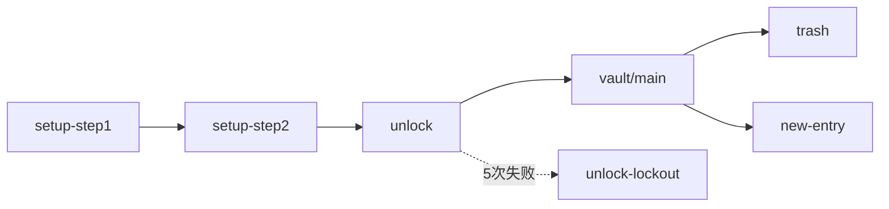

# KeyVault UI 原型

本目录保留 **canonical 原型**（每屏 `code.html` + `screen.png`）与 **必要说明**。实现 UI 时对照 `screens/` 与 [REQUIREMENTS-COVERAGE.md](./REQUIREMENTS-COVERAGE.md)。

## 如何查看

| 文件 | 用途 |
|------|------|
| `code.html` | 可交互布局稿，用浏览器直接打开 |
| `screen.png` | 静态截图，快速目视对比 |

开发验收：运行 `npm run tauri dev`，将实机界面与同路径的 `screen.png` / `code.html` 并排对比。

## 目录结构

```
docs/软件界面原型/
├── README.md                 # 本文件
├── REQUIREMENTS-COVERAGE.md  # 需求 ↔ 原型 ↔ 代码
├── SIGNOFF.md                # 人工目视验收清单
├── design-system/DESIGN.md   # 颜色、字体、间距令牌
└── screens/                  # 每屏含 code.html + screen.png
    ├── account/
    ├── vault/
    ├── modals/
    ├── settings/
    └── components/
```

## 屏幕索引

| 路径 | 界面 | Vue 实现 |
|------|------|----------|
| `screens/account/setup-step1-password/` | Setup 第 1 步 | `SetupView.vue` |
| `screens/account/setup-step2-confirm/` | Setup 第 2 步 | `SetupView.vue` |
| `screens/account/unlock/` | 解锁 | `UnlockView.vue` |
| `screens/account/unlock-lockout/` | 解锁锁定 | `UnlockView.vue` |
| `screens/vault/main/` | 主界面三栏 + 命令面板 | `VaultView.vue` + Shell |
| `screens/vault/trash/` | 回收站 | `VaultView` |
| `screens/vault/empty-states/` | 空状态 | `VaultEmptyState.vue` |
| `screens/vault/entry-detail-ssh/` | SSH / 通用详情 | `ItemDetail.vue` |
| `screens/vault/entry-detail-api-key/` | API Key 详情 | `ItemDetail.vue` |
| `screens/vault/note-layout-b/` | 笔记变体 B | ⏸ v1 延后 |
| `screens/modals/new-entry/` | 新建条目 | `EntryTypePicker.vue` |
| `screens/modals/delete-confirm/` | 删除 / 移至回收站 | `DeleteConfirmModal.vue` |
| `screens/modals/change-password/` | 修改主密码 | `ChangePasswordModal.vue` |
| `screens/modals/password-generator/` | 密码生成器 | `PasswordGenerator.vue` |
| `screens/modals/emergency-wipe/` | 紧急擦除 | `EmergencyWipeModal.vue` |
| `screens/settings/main/` | 设置 | `SettingsView.vue` |
| `screens/components/clipboard-timer/` | 剪贴板倒计时 | `ClipboardTimer.vue` |

## 布局约定（摘要）

| 区域 | 尺寸 / 说明 |
|------|-------------|
| 顶栏 | 40px |
| 侧栏 | 260px |
| 详情栏 | 400px |
| 主色强调 | `#58a6ff` |

完整令牌见 [design-system/DESIGN.md](./design-system/DESIGN.md)。代码侧令牌：`src/design/tokens.css`。

## 用户流程


